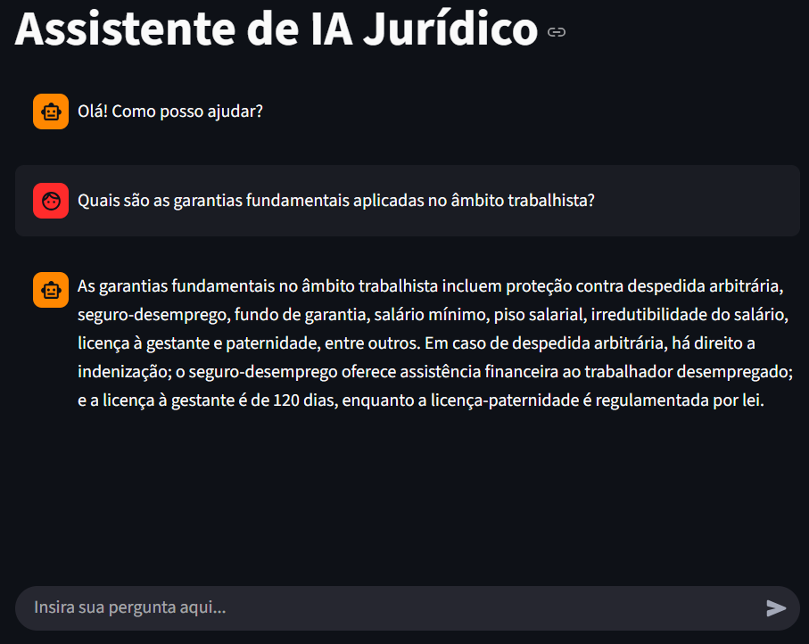

## ⚖️ **Legal Assistant RAG**

A Retrieval-Augmented Generation (RAG)-based legal chat assistant, built in Python with LangChain, using official legal documents — the Brazilian Federal Constitution and the CLT (Consolidation of Labor Laws) — as its knowledge base.
The goal of this project is to provide grounded and contextualized legal answers, mainly focused on constitutional and labor law topics.

## ⚙️ **Project Architecture**
This project follows the RAG (Retrieval-Augmented Generation) pattern, combining vector-based retrieval with natural language generation.
1. Document Preprocessing
    - Load legal documents (Federal Constitution and CLT).
    - Split the text into chunks using RecursiveCharacterTextSplitter.
    - Create embeddings using OpenAI Embeddings API.
    - Store embeddings in a ChromaDB persistent vector database.
2. Retrieval and Generation Pipeline
    - Retrieve the n most relevant text chunks based on the user query.
    - Generate a final answer using an OpenAI LLM, leveraging the retrieved context.
3. User Interface (Chat)
    - Built with Streamlit, allowing interactive, real-time conversations.

## 🧠 **Tech Stack**
| Component        | Technology                                              |
| ---------------- | --------------------------------------------------------|
| LLM & Embeddings | [OpenAI API](https://github.com/langchain-ai/langchain) |
| Vector Store     | [ChromaDB](https://github.com/langchain-ai/langchain)   |
| Front-end        | [Streamlit](https://streamlit.io/)                      |
| Language         | Python 3.13.0                                           |

## 🚀 Getting Started
1. Clone the repository
```bash
git clone https://github.com/your-username/legal-assistant-rag.git
cd legal-assistant-rag
```
2. Create a virtual environment and install dependencies
```bash
python -m venv venv
source venv/bin/activate  # Linux/Mac
venv\Scripts\activate     # Windows

pip install -r requirements.txt
```
3. Set environment variables

Create a .env file in the project root:
```env
OPENAI_API_KEY="your_api_key_here"
```
4. Generate the vector store

Set the vector store location in `settings/config.yaml`
```yaml
vector_store:
  persist_directory: [vector_store_dir_here]
  documents_directory: [source_docs_dir_here]
  collection_name: [vector_store_name]
```
Run the `create_vectorstore.py` script to create the vector store and add documents:
```bash
python create_vectorstore.py
```
5. Launch the chat interface
```bash
streamlit run app.py
```

## 💬 **Example**


## 📁 **Project Structure**
```bash
legal-assistant-rag/
│
├── docs/                   # Source documents (Constitution, CLT, etc.)
├── img/                    # Auxiliary images
├── settings/               # Configuration files
├── src/
│   ├── prompts/            # LLM prompts
├── utils/                  # Utilitaries
├── vectorstore/            # Persistent vector database (ChromaDB)
├── src/
│   ├── embeddings/            # Embedding generation classes
│   ├── rag_pipeline/          # Retrieval and generation logic
│   ├── utils/                 # Helper functions
│   └── app/                   
├── create_vectorstore.py      # Script to index and store documents
├── app.py                     # # Streamlit front-end code with chat entry point
├── requirements.txt
└── README.md
```

## 🧩 **Future Improvements**
- Add new legal documents (e.g., Civil Code, TST case law).
- Implement chat memory.
- Implement response caching for frequent queries.

## ⚖️ **Legal Disclaimer**
This assistant is intended for informational purposes only and does not replace professional legal advice.
All responses are generated by language models and may contain inaccuracies.
